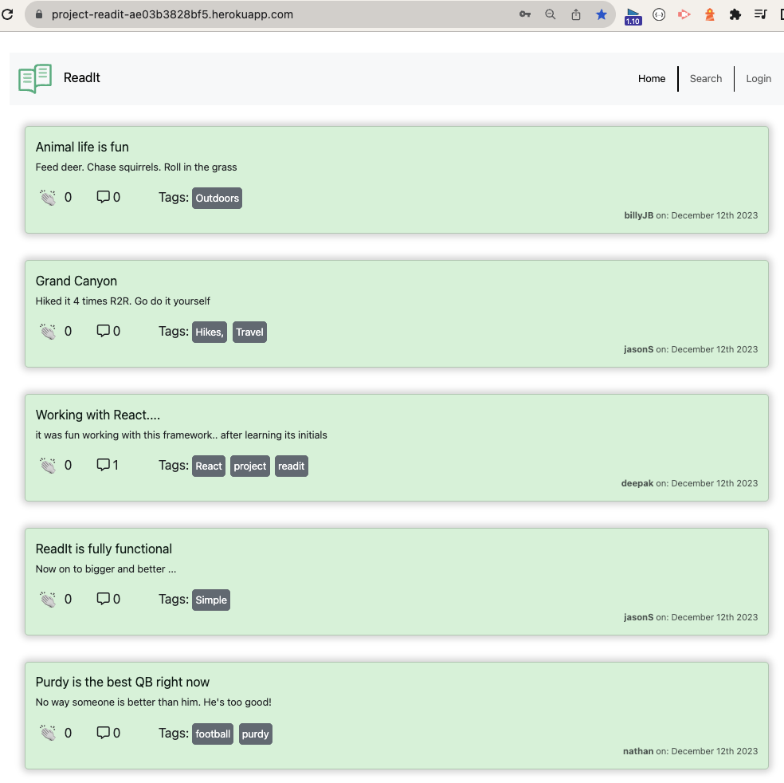
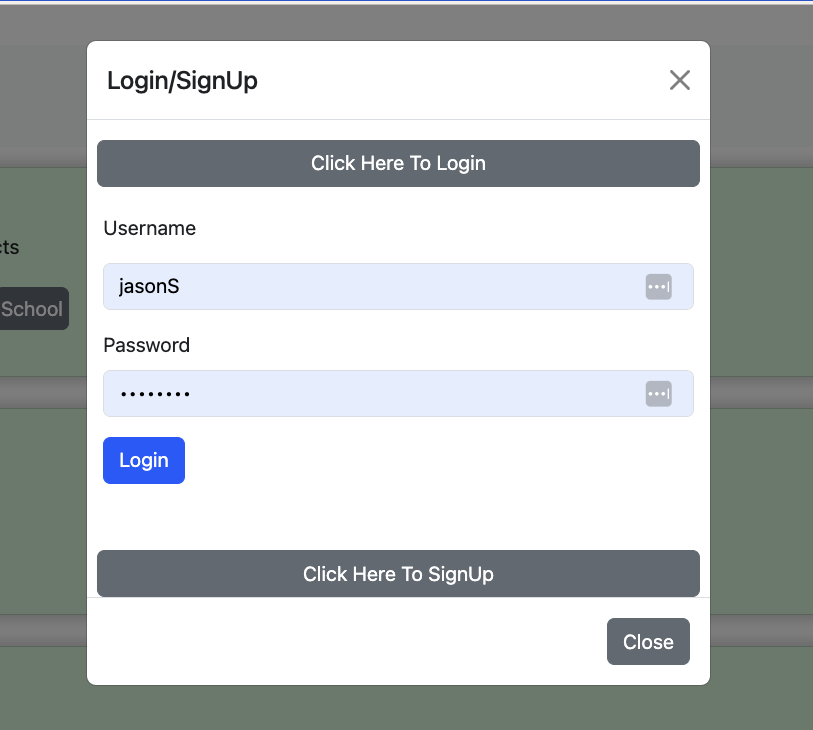
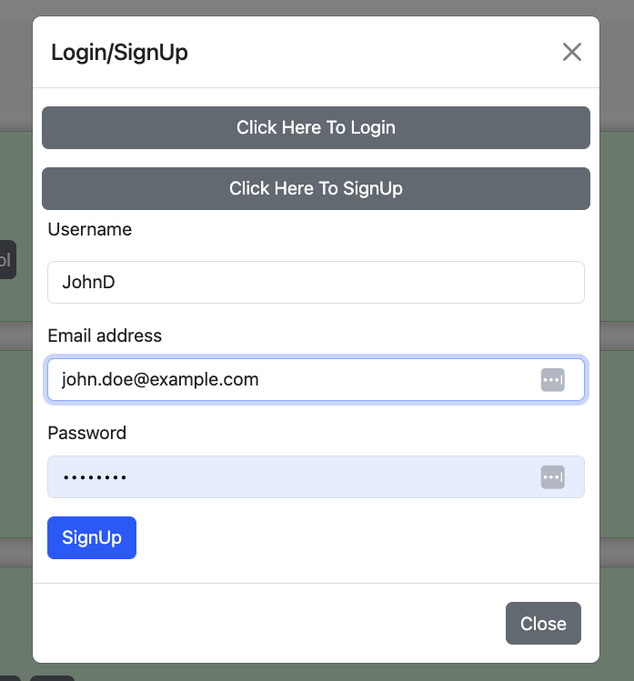
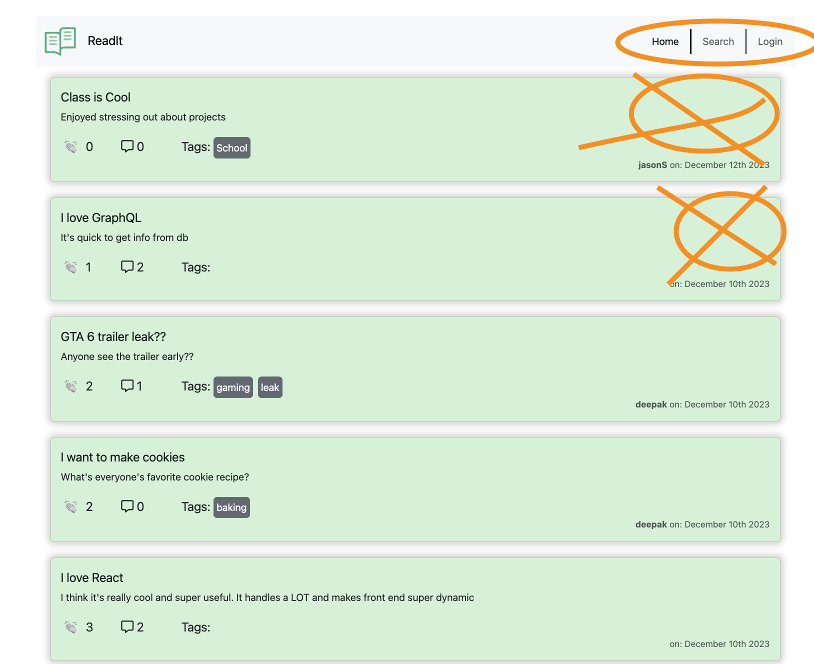

# ReadIt

The only blog that you'll need to post and comments.
(A microblogging site.)

## Table of Contents

* [Description](#description)
* [How to use ReadIt](#how-to-use-it)
* [Screenshots of Application](screenshots-of-application)
* [Defining our Working MVP](#mvp)
* [Learning Points](#learning-points)
* [Code Snippets](#code-snippets)
* [Contact Info](#contact-info)
* [Psuedo Code](#psuedo-code-for-this-project)

## Description

The ReadIt Application is a great way for users to Create posts on their favorite topics. They can comment on their posts and they can also comment on other peoples posts. 
We've made it so that users can also give an 'applause' (or like) to someone's post.

Other cools features are editing abilities for the user that is logged in, they can edit their own posts (but not others), edit their own comments (to their own comments), and Delete their own posts or comments.
---
## How to use it

When you as a user get to the landing page, you are presented with all of the posts within the application that all of the users have created. You are also able to read them and use the search bar to find a post you are looking for. However, you cannot add a reaction or create a post/comment unless you have a login.

### So, what do you have to do to fully use this app??

You will have to sign up first and then you can 
* create posts
* add comments
* edit your own stuff and 
* add reactions to any post.

Further features you will find here are after logging in: 
* You can check out your profile page will show you 
  * all of your own posts, in ascending order so you can see the latest things you've created.
* Edit abilities and creating comments

So, get moving and start posting! [Click Here](https://project-readit-ae03b3828bf5.herokuapp.com/) for the deployed link for ReadIt

---
## Here's what it looks like
Below is a description of what it a few parts are and what they look like

### This is the landing page
So, this is your landing page. You can see all posts, but you are not allowed to add comments or edit anything. Notice you are not logged in! you only see home, search and login. <br>


---
### You should log in
Now you are able to log in here, or even sign-up if you want to post or comment. It is easy!
<br> 

*Signin:*

 <br>

*Signup:*


---
### Login
lsk

---
###
lsk

---
###
lsk

---
###
lsk

---
###
lsk

---


## MVP

The following is a bar minimum of what we thought to create for a working MVP. It was actually quite a bit. Read through it if you wish to know our thought process and how we managed what we were working on throughout the duration of the project.

__This template provides a minimal setup to get React working in Vite with HMR and some ESLint rules.__

This is going to be a Blogging application
Posts
Comments
Likes/dislikes/reactions
Logins
Images

### As a user: I want to ...
* login/sign up
  * if you are not logged in, we can look around the front of th page. Read but not comment.
* After I log in I should just be dropped off at the dashboard page
  * Perhaps stay where they are (there will be a link to go to dashboard)
* Set a like or don't like on a post
* I should be able to create/add/edit/delete Tags to my post.
* Search posts
  * popularity
  * topic
  * tags
* Read all posts/threads
* ! edit someone elses posts !
* We want to do the following with posts
  * I would like to be able to create a post 
  * I want to be able to react to someone's post
  * I want to comment on a post
  * Search posts (see above)
* Be able to edit own posts
  * can also share links to posts with friends (postsId)
* Up vote, like, use smileys, etc .... apply this to the articles you have a thought on or just want a simple vote
  * a way to up or down vote or
  * use a icons (applause/clap icon ... use this as a default icon)
  * see number of likes

### What we need to build into the above
Notification?
---
  * You see new posts notifications
  * see reactions to a post you made
    * can click on it and view  the article

Search
---
How to do this?
Tags in the post (cars, politics, food, cats, pets, etc)
Categorizing posts


What am I going to see?
---
User icon
Notifications
Posts (mine and others)

Requirements
* Use React
* Mongoose (Mongo)
* graphQL

3rd Party Packages/Library
* Giphy API
* Images
* ChartJs ???? there is one for React
* Bootstrap/iconpack
  * possibly Fontawesome.

### Models (for whatever db we use)
  * User
    * id (gets created for us)
    * Name
    * Username
    * email address
    * password
    * Friends []
    * posts [postids] // (remember the thoughts ... populate method with this one)

  * Posts
    * id
    * title
    * userid
    * post_text
    * comments [{
        userid:
        text:
        reactions: 
        }]
    * reaction [{
      userid:
      applause: (true|false)
    }]
    * Tags
    *  We can do this similary to 17-NoSql/activities/23-ins.....
     ```js
    {
    toJSON: {
      virtuals: true,
    },
    id: false,
  }

  postSchema
  .virtual('upvoteCount')
  // Getter
  .get(function () {
    return this.meta.upvotes;
  });
  ```


Things todo:
Session id?
How do we actually enable reactions for a logged in user?

Create a dashboard

## Things we'd like
* to be able to actually chat with someone online
* Need to have user and admin permissions
* 


Reactions
If a user clicks on it, it will only toggle either on or off.
Click once, it ups the number.
Click on it again, it will take it a way.
If a user clicks on one or the other, it will increment one and decrement the other.

Handler/Event listenter for reaction to a post
```js
if (!upvote && ! downvote){
    if (integer has value){
        decrement
    } else {
        Increment
    }
}
```

If (user clicks again on the same upvote)
counter button that shows up, be able to click on it. It will either increment or decrement a count number in the database.


Images
* user profile image
* be able to add an image for a thread or comment.
  * how to store an image for a thread/comment.
  * can convert it to a base64 image. (multer package).

Perhaps we can use a giphy api to insert images 

### If we have time ....
Sharing...
---
* Have people that we want to share with (or friends).
* Send them a URL
  - able to write the link to the article url or id to the user and have it write it into the database
* I want a friends feature.
  * I'd like to be able to share posts with others?
  * Add them
  * see them
* Notifications ... create this schema if we have the time
// If we have time ...
  <!-- * Notifications
    * id
    * username [] -->


// landing page is all posts
// have login 

>>>>>>>>>>>>>>>>>>>>>>>>>>>>>>>>>>>>

## git workflow !!

git pull origin main
create a new branch feature/<feature-name>


always do this before creating a PR

commit your changes.  
git add .
git commit -m "message"
git pull origin main  
resolve any merge conflicts using Visual studio code

git add . 
git commit -m "message"
git push origin feature/<feature-name>

got to github and create a PR.


>>>>>>>>>>>>>>>>>>>>>>>>>>>>>>>>>>>>>>>
friday day 1


login/signup :  backend, create UI and integrate

Home: View posts

Create and save a post.

post component: for displaying !

>>>>>>>>>>>>>>>>>>>>>>>>>>>>>>>>

whats left saturday

intgrate saving post to backend.

sign up - done

Notifications inside the form login/signup
login/logout is done.
toggle signup and login


Home page

view a post - done [disable link to view-post once the user is on the view-post url !!]
add comments 
add reactions to a post

My post page
edit your posts/delete posts.

Search display posts and the logic to search


Tags !!

STYLING !!


>>>>>>>>>>>>

More commits !!

2 new technologies !!!

1. Moment.js for formatting time stamps
2. font awesome for icons

3. ??

### What is left.
* Update applause (reactions)
* Delete a post
* Use at least 2 libraries
  * fontawesome
  * date formatter called DayJS
  * momentjs
* Styling
* Diplaying Tags?
* Custom alerting (modals)
  * Create a post is a page, but could be more of a window that pops up (modal)
* Edit Comments (user owned)
* Delete comments (user owned)
* Dashboard needs updating to have more than just my own posts
