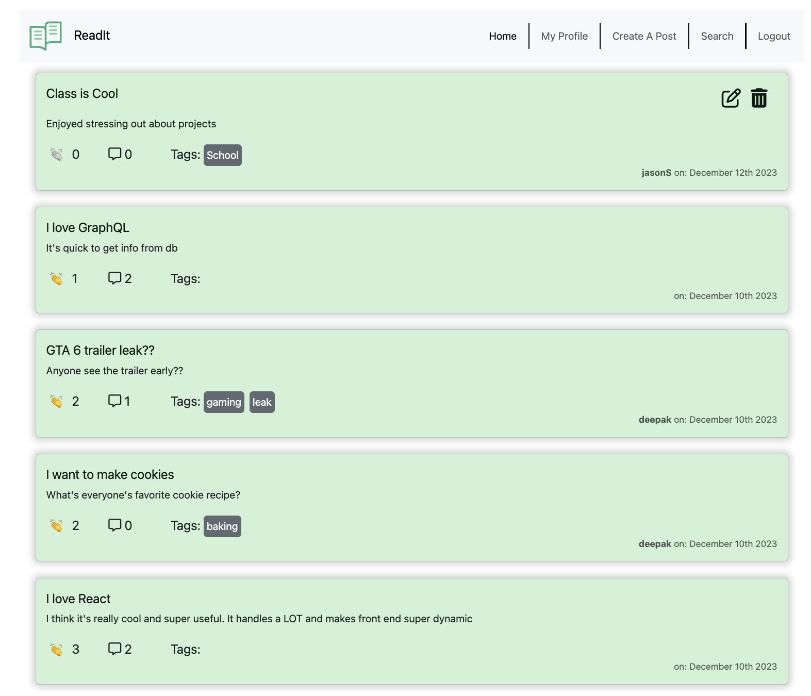
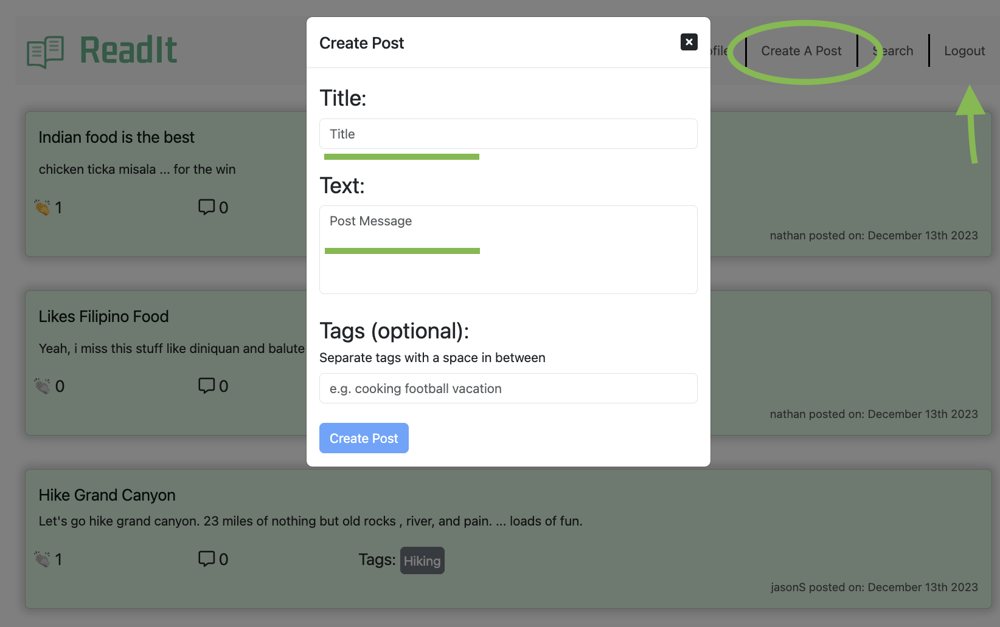
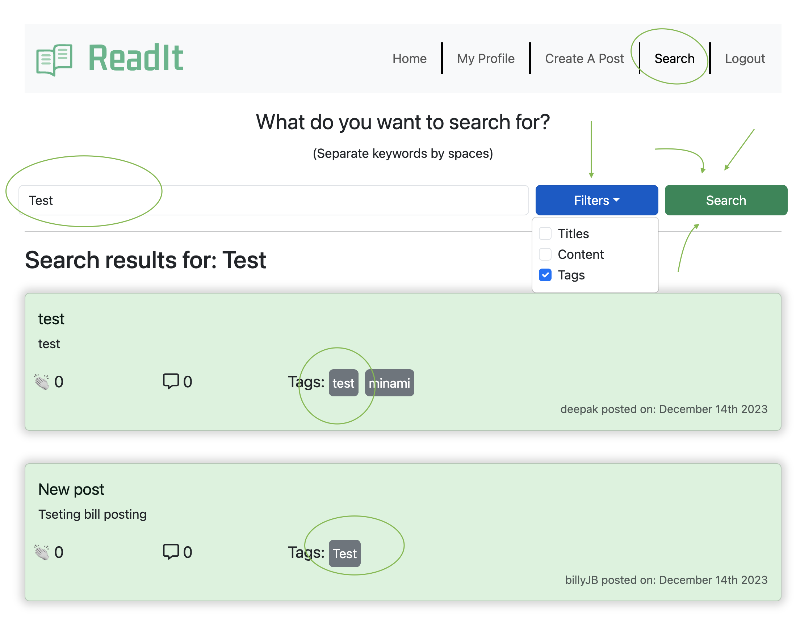
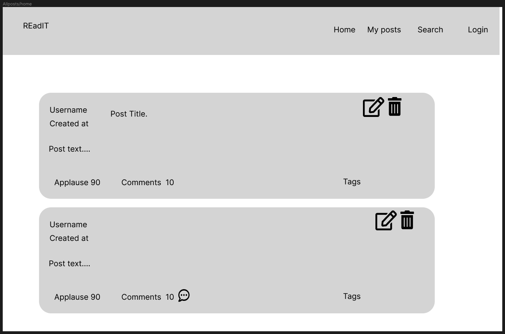
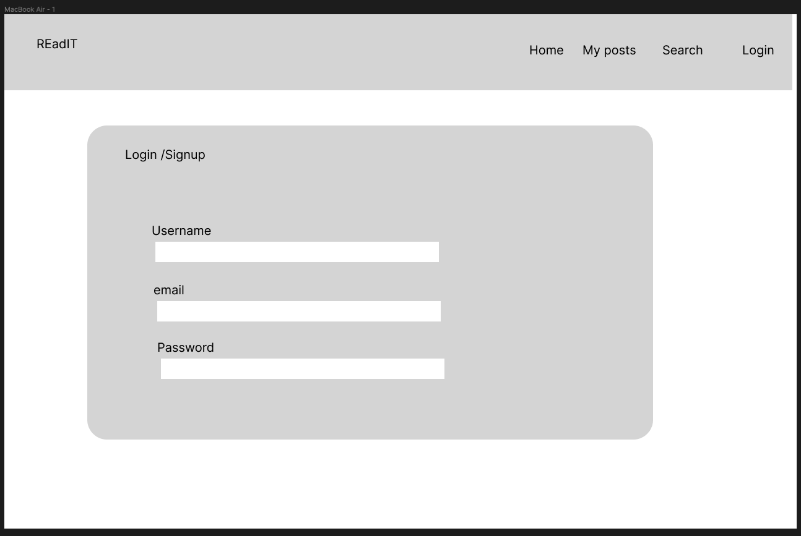
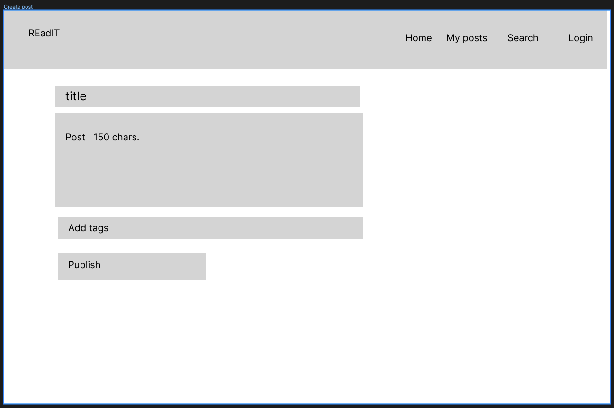
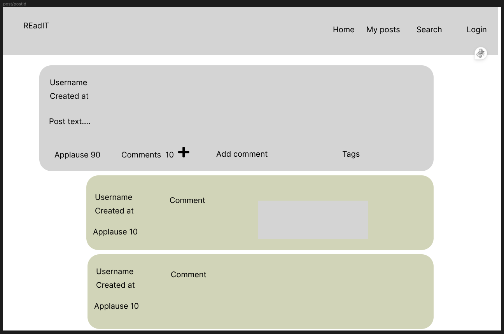
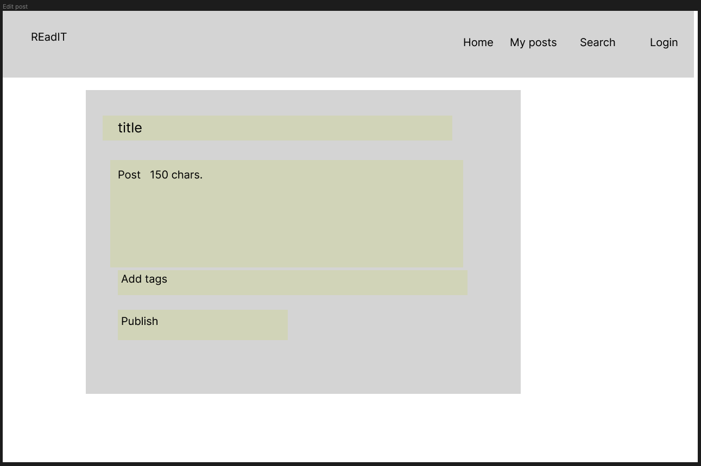
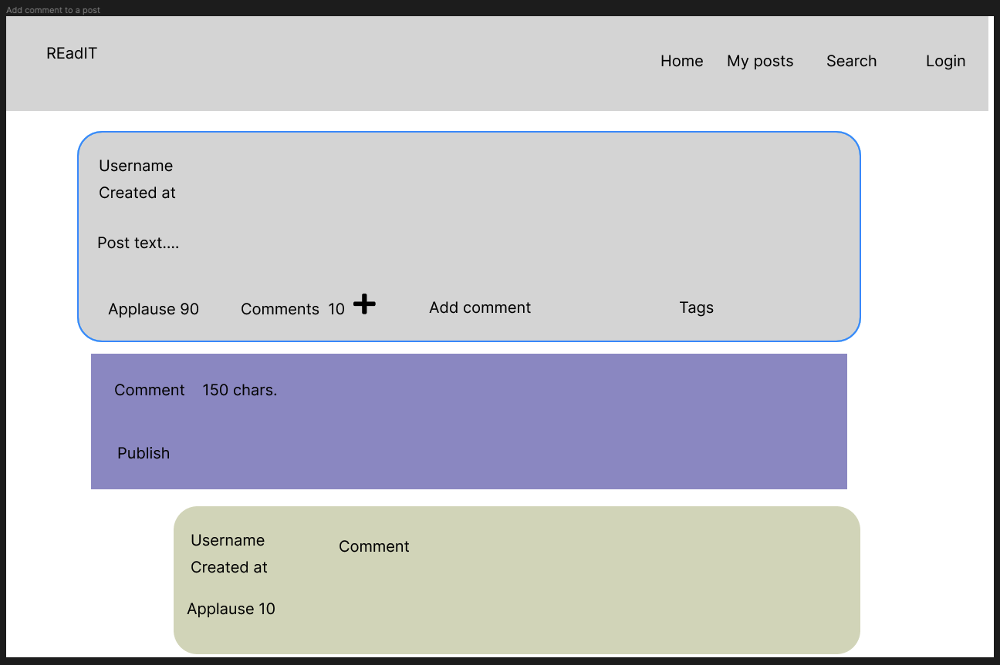

# ReadIt

ReadIt is a microblog site where users can talk about topics, news, and more while interacting with other users by applauding and commenting on other posts.

## Table of Contents

* [Description](#description)
* [How to use ReadIt](#how-to-use-it-and-what-it-looks-like)
* [Mockups](#here-are-the-mockups-that-we-created)
* [Defining our Working MVP](#mvp)
* [Learning Points](#learning-points)
* [Code Snippets](#code-snippets)
* [Credits](#credits)
* [Contact Info](#contact-info)

## Description

The ReadIt Application is a great way for users to Create posts on their favorite topics. They can comment on their posts and they can also comment on other peoples posts. 
We've made it so that users can also give an 'applause' (or like) to someone's post.

Other cools features are editing abilities for the user that is logged in, they can edit their own posts (but not others), edit their own comments (to their own comments), and Delete their own posts or comments.

### So, what do you have to do to fully use this app??

You will have to sign up first and then you can 
* create posts
* add comments
* edit your own stuff and 
* add reactions to any post.

Further features you will find here are after logging in: 
* You can check out your profile page will show you 
  * all of your own posts, in ascending order so you can see the latest things you've created.
* Edit abilities and creating comments

<span style="color: yellow;font-weight: bold;">So, get moving and start posting! [Click Here](https://project-readit-ae03b3828bf5.herokuapp.com/) ...for the deployed link for ReadIt</span>

---

## How to use it, and what it looks like

When you first come to the landing page (logged in or not) you are presented with all of the posts within the application that all of the users have created. You are able to read and search through all posts. Just not able to comment, update, or react to the posts. 

### This is the landing page

<details>
  <summary><span style="color: green; font-weight: bold;">Here is the Landing Page</span></summary>
 
  
</details>

### However, you cannot add a reaction or create a post/comment unless you have a login. Here are some examples of login, and sign up that you should do next.
If not Logged in, you will see the opening page like this: 
<details>
  <summary><span style="color: green; font-weight: bold;">THIS IS NOT LOGGED IN</span></summary>
  
  
</details>
<br>
If not, 
<details>
  <summary><span style="color: green; font-weight: bold;">then login like this</span></summary>
  
  
</details>
and get going on reading/posting/commenting.
<br>
<br>
Or you can 
<details>
  <summary><span style="color: green; font-weight: bold;">sign-up, like the following</span></summary>
  
  
</details> and enjoy the application a big more.
<br>
<br>

### Once you are logged in. You will see the landing page and be able to create-posts, see what is in your profile (if an) and update/comment on all of your posts. Below is what it will look like after you sign in.
<details>
  <summary><span style="color: green; font-weight: bold;">After you sign in</span></summary>
  
  
</details> now go and start posting

### Here is what it will be like when you go to create a post.
<details>
  <summary><span style="color: green; font-weight: bold;">Click Create Post Link</span></summary>
  
  
</details> You click on the "Create Post" link and fill in Title and Message Text. Tags are optional. Then click <span style="color: blue; font-weight: bold;">"Create Post"</span> button.

### Lastly, besides exploring on your own, you can search. Search by tag or text. You have options.
<details>
  <summary><span style="color: green; font-weight: bold;">See What Search Can Do</span></summary>
  
  
</details> Search is fun and extensive. <span style="color: green; font-weight: bold;">"Search"</span> button.
<br>
There is loads more. Go and explore.


## Here are the mockups that we created.
### The site actually came out quite a bit like the mockups. You will see that when you go to it (link is at the top of this page) and start exploring.

---
<details>
  <summary><span style="color: green; font-weight: bold;">Landing Page and Portal Layout ... see all posts</span></summary>
  
  
</details>

---
<details>
  <summary><span style="color: green; font-weight: bold;">Login and Signup page</span></summary>
  
  
</details>

---
<details>
  <summary><span style="color: green; font-weight: bold;">Creating a Post after login and what you will see</span></summary>
  
  
</details>

---
<details>
  <summary><span style="color: green; font-weight: bold;">The Post and PostId along with comments and after login</span></summary>
  
  
</details>

---
<details>
  <summary><span style="color: green; font-weight: bold;">What we see when editing a Post</span></summary>
  
  
</details>

---
<details>
  <summary><span style="color: green; font-weight: bold;">And lastly, adding comments to a post</span></summary>
  
  
</details>

---

## Learning Points

* Client side gql mutations have an effect on the `useMutation` hooks. If the mutation gql doesn't return the appropriate values that are updated, then the `useMutation` hook will not cause a component render.

## Code Snippets

Mutation of updating a nested subdoc's array.
```js
addReactionToComment: async (parent, { postId, commentId, ...newReaction }) => {
  return await Post.findOneAndUpdate(
    { _id: new ObjectId(postId), 'comments._id': new ObjectId(commentId) },
    {
      $push: { 'comments.$.reactions': newReaction }
    },
    { new: true }
  )
}
```

## Credits

[Comparing ObjectIds](https://futurestud.io/tutorials/mongodb-how-to-compare-objectids-in-node-js)

[Using async in react `useEffect` hook](https://devtrium.com/posts/async-functions-useeffect)

[Idea for multiple $or queries](https://stackoverflow.com/a/37722869)

[Idea for react rendering with multiple conditions](https://dev.to/samba_code/nested-ternary-statements-in-react-jsx-35kp)

[Idea for using `filter: saturate` for handclap emoji](https://stackoverflow.com/questions/58450687/how-to-style-a-unicode-character)

### Resources 

[JWT docs](https://www.npmjs.com/package/jsonwebtoken)

[Mongoose $each](https://www.mongodb.com/docs/manual/reference/operator/update/push/)

[MongoDB Indexes for $text](https://stackoverflow.com/a/59922531)

[MongoDB using Regex in .find()](https://www.mongodb.com/docs/manual/reference/operator/query/regex/#examples)

[Google fonts](https://fonts.google.com/specimen/Kdam+Thmor+Pro?classification=Display&stroke=Sans+Serif)

## Contact Info

| Collaborator | GitHub | Reach Out to Us |
| :--- | :---: | :---: |
| Jorge Castro | [Profile](https://github.com/Jacastro619) | [Email](jorgecastro619@gmail.com) |
| Deepak Sinha | [Profile](https://github.com/dee-here) | [Email](deepakdilse@gmail.com)|
| Jason Savoie | [Profile](https://github.com/flimits) | [Email](flimits@gmail.com) |
| Nathan Geronimo | [Profile](https://github.com/nathangero) | [Email](nathanageronimo@gmail.com)  |

