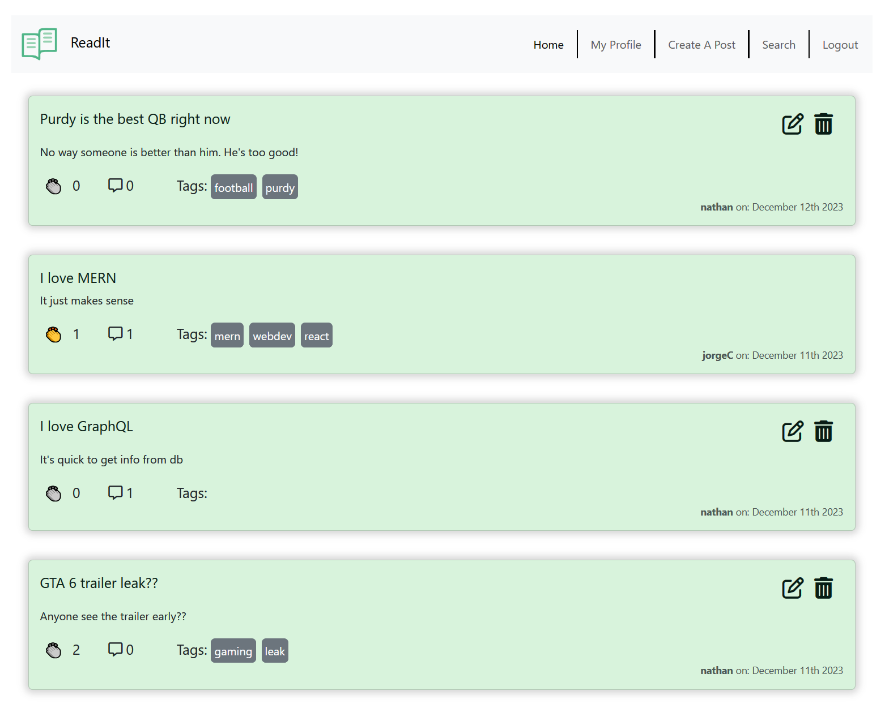

# ReadIt

ReadIt is a microblog site where users can talk about topics, news, and more while interacting with other users by applauding and commenting on other posts.

## Table of Contents

* [Description](#description)
* [How to use ReadIt](#how-to-use-it)
* [Screenshots of Application](screenshots-of-application)
* [Defining our Working MVP](#mvp)
* [Learning Points](#learning-points)
* [Code Snippets](#code-snippets)
* [Credits](#credits)
* [Contact Info](#contact-info)

## Description

The ReadIt Application is a great way for users to Create posts on their favorite topics. They can comment on their posts and they can also comment on other peoples posts. 
We've made it so that users can also give an 'applause' (or like) to someone's post.

Other cools features are editing abilities for the user that is logged in, they can edit their own posts (but not others), edit their own comments (to their own comments), and Delete their own posts or comments.

## How to use it

When you as a user get to the landing page, you are presented with all of the posts within the application that all of the users have created. You are also able to read them and use the search bar to find a post you are looking for. However, you cannot add a reaction or create a post/comment unless you have a login.
<details>
  <summary><span style="color: green; font-weight: bold;">THIS IS NOT LOGGED IN</span></summary>
  
  
</details>


### So, what do you have to do to fully use this app??

You will have to sign up first and then you can 
* create posts
* add comments
* edit your own stuff and 
* add reactions to any post.

Further features you will find here are after logging in: 
* You can check out your profile page will show you 
  * all of your own posts, in ascending order so you can see the latest things you've created.
* Edit abilities and creating comments

So, get moving and start posting! [Click Here](https://project-readit-ae03b3828bf5.herokuapp.com/) for the deployed link for ReadIt

---
## Here's what it looks like
Below is a description of what it a few parts are and what they look like

### This is the landing page
So, this is your landing page. You can see all posts, but you are not allowed to add comments or edit anything. Notice you are not logged in! you only see home, search and login. <br>


---
### You should log in
Now you are able to log in here, or even sign-up if you want to post or comment. It is easy!
<br> 

<details>
  <summary><span style="color: green; font-weight: bold;">Click here to see what the SignIn page looks like</span></summary>
  
   <br>
</details>
---
<details>
  <summary><span style="color: green; font-weight: bold;">Click here to see what the SignUp page looks like</span></summary>
  
   <br>
</details>
---

So, get moving and start posting! [Click Here](https://project-readit-ae03b3828bf5.herokuapp.com/) for the deployed link for ReadIt.

## Images Of the Site (Sign up yourself to get a better view of it)

Screenshot of our website's homepage



## Learning Points

* Client side gql mutations have an effect on the `useMutation` hooks. If the mutation gql doesn't return the appropriate values that are updated, then the `useMutation` hook will not cause a component render.

## Code Snippets

Mutation of updating a nested subdoc's array.
```js
addReactionToComment: async (parent, { postId, commentId, ...newReaction }) => {
  return await Post.findOneAndUpdate(
    { _id: new ObjectId(postId), 'comments._id': new ObjectId(commentId) },
    {
      $push: { 'comments.$.reactions': newReaction }
    },
    { new: true }
  )
}
```

## Credits

[Comparing ObjectIds](https://futurestud.io/tutorials/mongodb-how-to-compare-objectids-in-node-js)

[Using async in react `useEffect` hook](https://devtrium.com/posts/async-functions-useeffect)

[Idea for multiple $or queries](https://stackoverflow.com/a/37722869)

[Idea for react rendering with multiple conditions](https://dev.to/samba_code/nested-ternary-statements-in-react-jsx-35kp)

[Idea for using `filter: saturate` for handclap emoji](https://stackoverflow.com/questions/58450687/how-to-style-a-unicode-character)

### Resources 

[JWT docs](https://www.npmjs.com/package/jsonwebtoken)

[Mongoose $each](https://www.mongodb.com/docs/manual/reference/operator/update/push/)

[MongoDB Indexes for $text](https://stackoverflow.com/a/59922531)

[MongoDB using Regex in .find()](https://www.mongodb.com/docs/manual/reference/operator/query/regex/#examples)

[Google fonts](https://fonts.google.com/specimen/Kdam+Thmor+Pro?classification=Display&stroke=Sans+Serif)

## Contact Info

| Collaborator | GitHub | Reach Out to Us |
| :--- | :---: | :---: |
| Jorge Castro | [Profile](https://github.com/Jacastro619) | [Email](jorgecastro619@gmail.com) |
| Deepak Sinha | [Profile](https://github.com/dee-here) | [Email](deepakdilse@gmail.com)|
| Jason Savoie | [Profile](https://github.com/flimits) | [Email](flimits@gmail.com) |
| Nathan Geronimo | [Profile](https://github.com/nathangero) | [Email](nathanageronimo@gmail.com)  |

